# Welcome to The Guild Hall
The Guild Hall is a *Dungeons & Dragons* (D&D) inspired website using Knex/PostgreSQL backend database and modular React frontend.

# The Guild Hall:

## 🏰 Guild Navigation

Dynamic and thematic navigation is critical for party members as they traverse the Guild Hall. Rather than generic web links, the global navigation menu automatically adapts its aesthetics, materials, and conduits to mirror the room currently being explored.

* **⚙️ The Knowledge Foundry (The Archmage):** Riveted dark iron plates framed with polished brass bevels and a subtle cyan conduit glow. Represented by the ancient mechanical cog (`⚙️`).

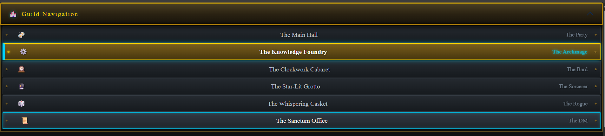

* **🍻 The Main Hall (The Party):** Warm dark oak paneling, forged wrought-iron brackets, and amber firelight shadows. Represented by a foaming tavern tankard (`🍻`).

* **🕰️ The Clockwork Cabaret (The Bard):** A 45-degree angled switchboard, glowing neon nixie tubes, and brass toggles. Represented by the clockwork mechanism (`🕰️`).

* **🔮 The Star-Lit Grotto (The Sorcerer):** Deep purple velvet textures with pulsing, floating arcane sigils and glowing particle borders. Represented by the crystal orb (`🔮`).

* **🎲 The Whispering Casket (The Rogue):** Scarred mahogany wood grain, brass coin accents, leather binding straps, and subtle lantern glow. Represented by the gaming die (`🎲`).

* **📜 The DM Sanctum (The Dungeon Master):** Gold-leaf stamped cursive, wax-draped parchment edges, and a scholar's dark mahogany trim. Represented by the rolled campaign scroll (`📜`).

---

# The Guild Hall: Knowledge Foundry
The Guild Hall's Bestiary & Creature Repository, belongs to the Archmage and was inspired by my love of steampunk aesthetics, classic fantasy, and wild mechanical gadgets.

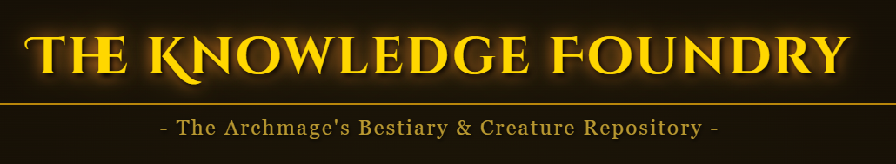

---

### Loading State
While the data is being fetched the Bestiary Loading screen flashes as seed data populates from the `FullMonster` GET request:

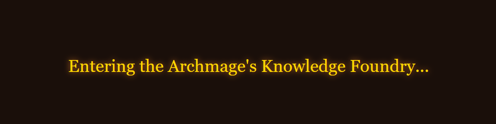

---

### Main Creature Card
Upon entering the Bestiary, the main creature card adopts a layout inspired by conventional D&D creature stat blocks:
 * **Header:** Displays the creature's name, size, type, and alignment. 
 * **Middle Section** Spilt between core stats, vitals, and rewards on the left with the creature's portrait on the right. 
 * **Bottom Section** Spilt between the primary attacks and special attributes. 

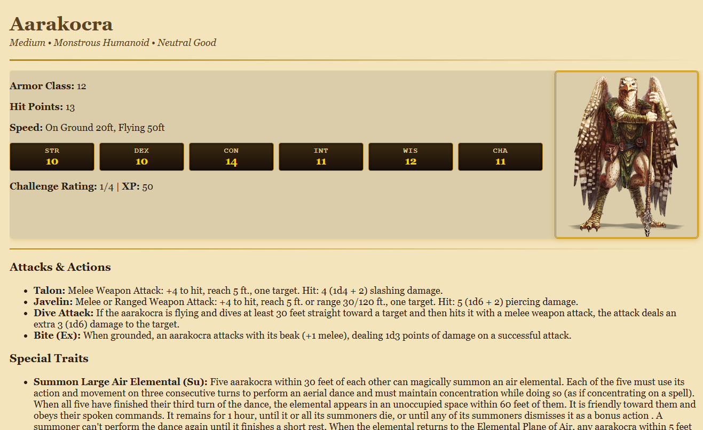

---

### Right-Side Control Panel Experience

Designed specifically to help onboard new Dungeon Masters (DM) who may be unfamiliar with D&D mechanics.

#### Creature Information (Bottom Half)
Helps new DMs quickly understand what a creature's type implies, what their alignment ethos signifies, along with a detailed creature analysis and lore breakdown.

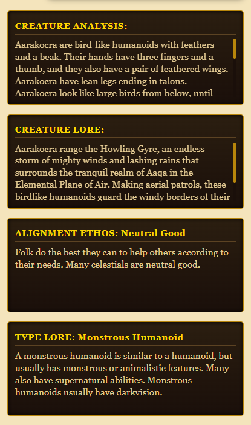

#### Dynamic Actions & Filtering (Top Half)

* **Live Search:**
A dynamic search bar at the top instantly filters out creatures from the main cog mechanism as you type.

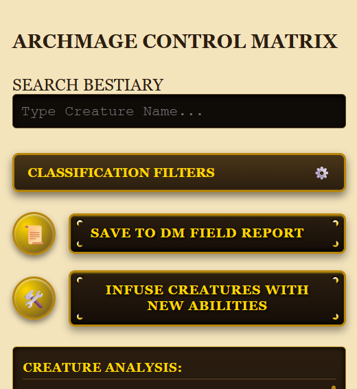

* **Felt Drop-Down Drawer:**
Allow the DMs to search by monster type. For example, if a DM wants to build an undead army. Select the cog on the drawer and in the drop-down drawer select the lightbulb next to "Undead". The main lower cog will filter out all non-undead creatures. 

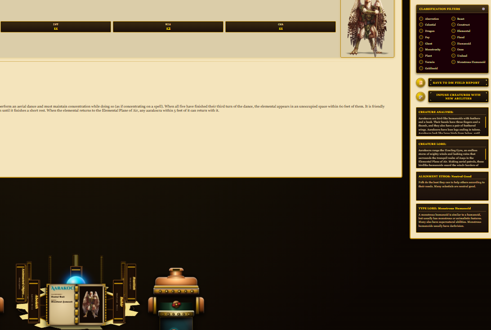

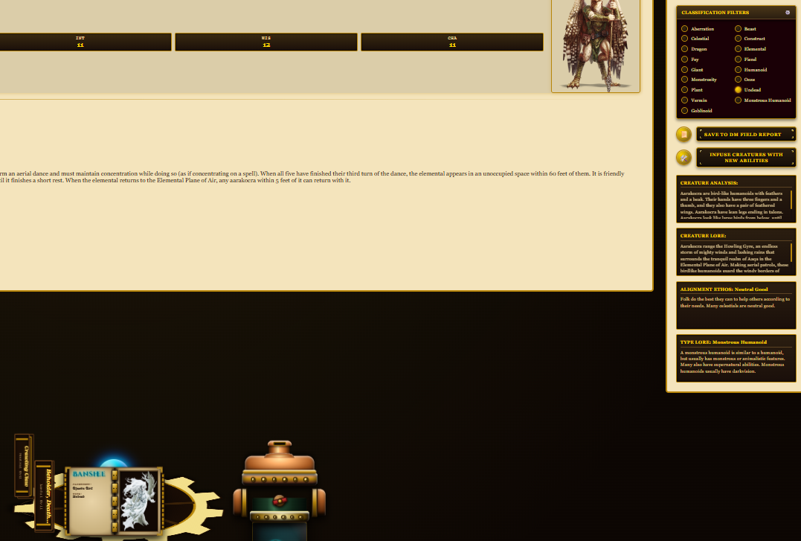

#### Immersive Action Buttons

* **Save to DM Field Report:**
Allowing the DM to save a creature's base stats directly to their campaign report for retrieval elsewhere in the Guild Hall.

* **Infuse Creatures with New Abilities:**
Empowers the DM to dynamically modify and upgrade a creature's base stats for custom encounters.

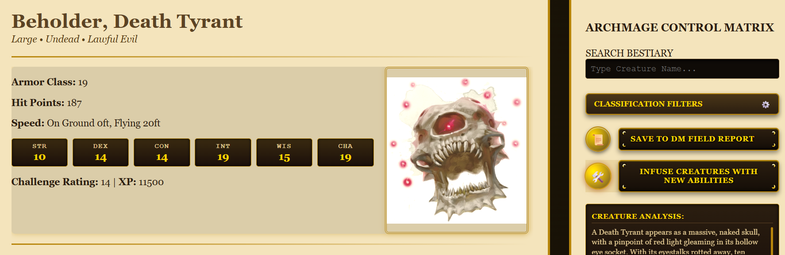

---

### Creature Forge & Field Workshop

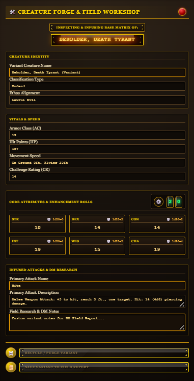

The Creature Forge is where the DM can create a one of kind variant. As the DM modifies a field the border will highlight the edges gold.

#### Creature Forge (Top Half)

* **Header:**
The top half of the Forge has a mystical ruby gem infused into a brass ring allowing the DM to close out of the forge. Below that the DM will see the active monster's name flickering just underneath a riveted plaque.

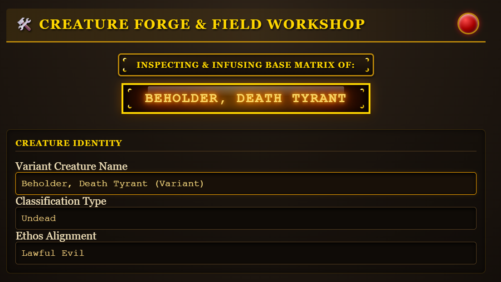

* **Creature Identity:**
Allows the DM to change the creature's name, it's type classification, and it's alignment ethos.

#### Creature Forge (Second Section)
* **Vitals and Speed:**
In this section the DM can update the creature's Armor Class, Hit Points, Experience Points, Speed, and Challenge Rating.

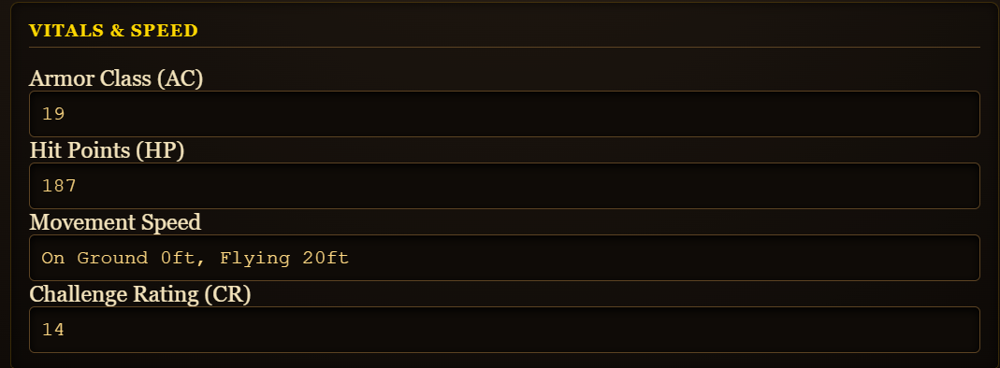

#### Creature Forge Stats

* **Core Attributes & Enhancements Rolls:**
As the DM builds their variant they can improve on their core attributes using d20 rolls.

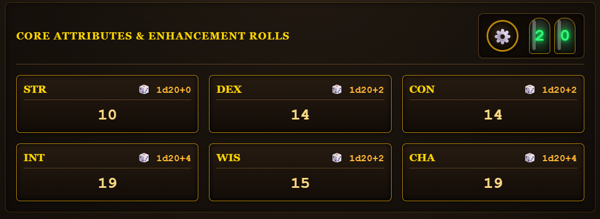

Don't have a physical d20? The Forge has you covered with a steampunk-inspired, pneumatic nixie-tube green light dice counter. Just press the gear and let the tube roll the dice!

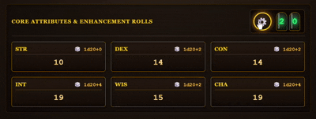

#### Creature Forge Bottom Section

* **Infused Attacks & DM Research:**
If the DM would like to give his variant a special ability or make important tactical notes, they can record them here.

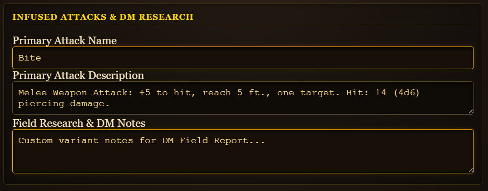

#### Forge Action Buttons

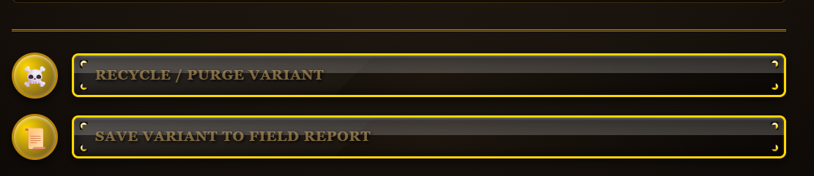

* **Recycle / Purge Variant:**
If the DM determines the variant isn't worth saving, they can purge the variant from the system.
* **Save Variant To Field Report:**
Saves the creature variant directly to their campaign report for retrieval elsewhere in the Guild Hall.

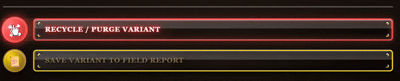

---

### The Archmage’s Knowledge Foundry

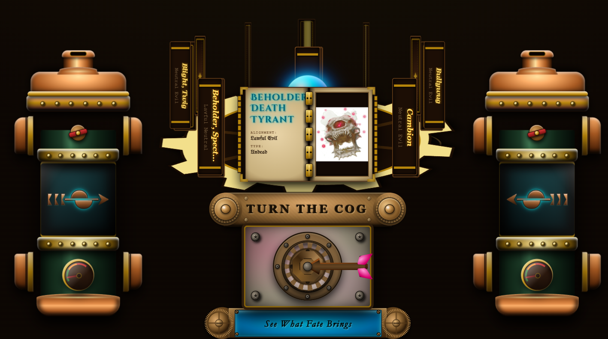

* **The Foundry's Ancient Cog:**
The Archmage’s Knowledge Foundry is where all ancient lore and creature knowledge is stored. The Archmage placed a protection spell on his tomes balancing an ancient spinning cog upon a magical orb. Selecting the active (center) tome updates the active monster in the Main Creature Card.

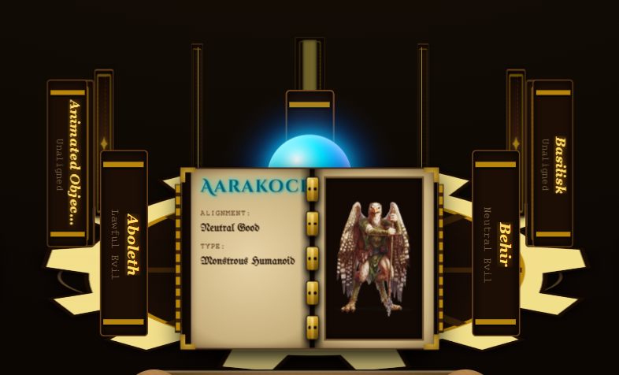

* **The Foundry's Engine Stacks:**
The Archmage imbued the canisters to handle transitions between the various tomes on the cog, venting excess magic energy. When normal magic energy is released, it appears as a simple blue mist while the gauge needle rises in acknowledgement.

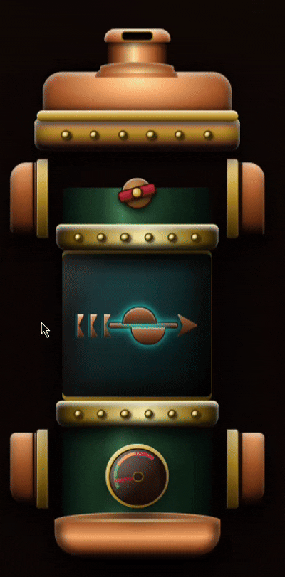

Each canister controls the cog and it's tome rotation in one of two directions. The cog to the left handles the tradtional previous button.

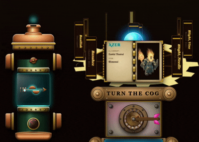

The cog to the right handles the tradtional next button.

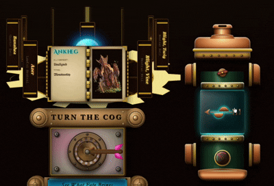

* **The Foundry's Wild Magic Container:**
The Archmage borrowed Fate's ability to predict what the DM is looking for by infusing the marbled plate underneath the cog with special magic. 

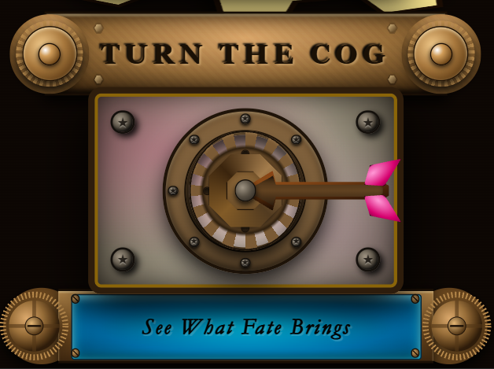

The magic randomly spins the cog to select a creature. However, the wild magic is so unpredictable that it over pressurizes all the key components maintaining the cog. The engine canister's vent stack must work overtime to vent the excess magic quickly!

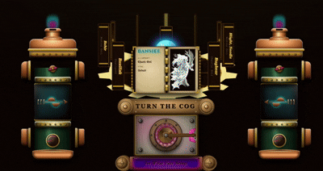