# Welcome to The Guild Hall
The Guild Hall is a *Dungeons & Dragons* (D&D) inspired website using Knex/PostgreSQL backend database and modular React frontend.

# The Guild Hall:

## 🏰 Guild Navigation

Dynamic and thematic navigation is critical for party members as they traverse the Guild Hall. Rather than relying on generic web components, the global navigation menu automatically adapts its aesthetics, materials, and hardware conduits to mirror the room currently being explored.

* **🍻 The Main Hall (The Party):** Warm dark oak paneling, forged wrought-iron brackets, and amber firelight shadows. Represented by a foaming tavern tankard (`🍻`).

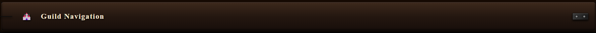

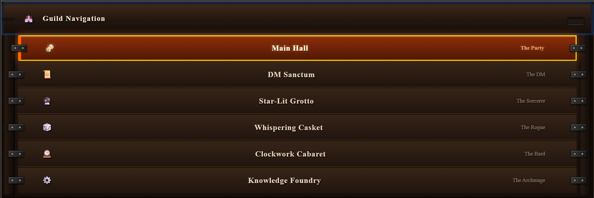

* **📜 The DM Sanctum (The Dungeon Master):** Gold-leaf stamped cursive, wax-draped parchment edges, and a scholar's dark mahogany trim. Unlock the DM drawer to transition to another party member's file, highlighted by a deep, rich mahogany spine with a glowing red wax seal. Represented by the rolled campaign scroll (`📜`).

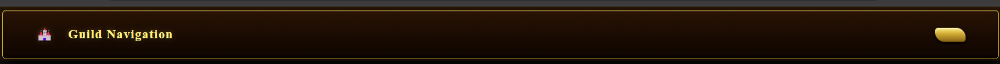

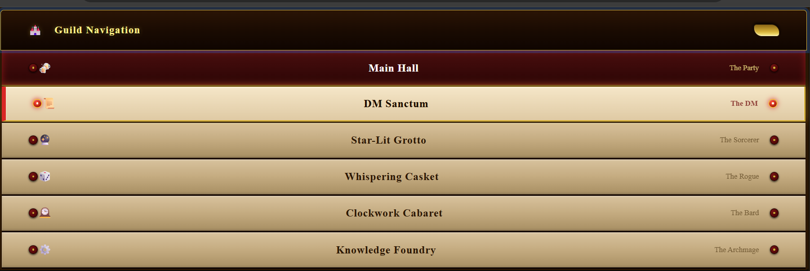

* **🔮 The Star-Lit Grotto (The Sorcerer):** Deep purple velvet textures with pulsing, floating arcane sigils and glowing particle borders. Reach out and touch the rune of "Home" to choose a "Destiny", accented by a cavernous night sky with twinkling celestial stars. Represented by the crystal orb (`🔮`).

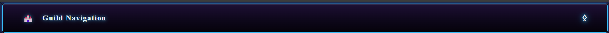

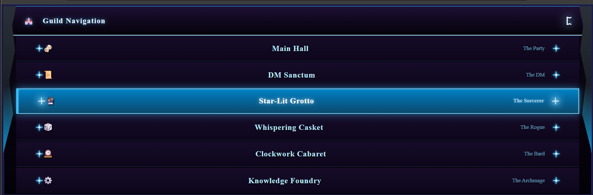

* **🎲 The Whispering Casket (The Rogue):** Scarred mahogany wood grain, 3D coin flip hardware, leather binding straps, and subtle lantern glow. Dare to take a chance and flip the Rogue's coin to see if Lady Luck is on your side—as you inspect your target, your luck just might roll from a Nat 1 to a Nat 20. Represented by the gaming die (`🎲`).

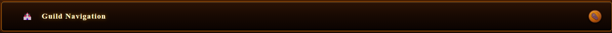

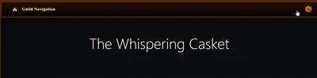

* **🕰️ The Clockwork Cabaret (The Bard):** Cast brass bevels, dark rose glass switchboard panels, and ruby-neon vacuum tubes. Pull the 3D industrial knife switch down to flip the main power on, lighting up custom per-row filaments as you dance through the intricate inner workings of the Cabaret. Represented by the clockwork mechanism (`🕰️`).

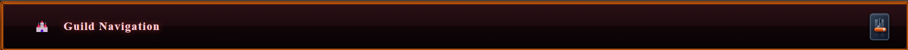

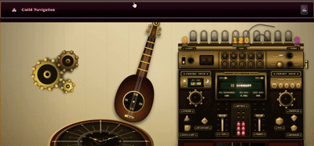

* **⚙️ The Knowledge Foundry (The Archmage):** Riveted dark iron plates framed with polished brass bevels and an unpowered-to-active cyan conduit energy grid. Engaging the ancient brass gear powers up the arcane engine to open portals to new adventures. Represented by the mechanical cog (`⚙️`).

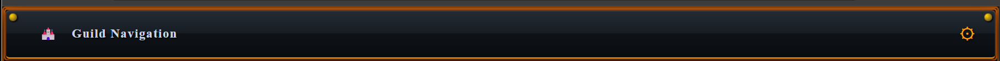

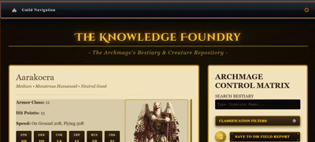

---

# The Guild Hall: Main Hall

Welcome to the Guild Hall! The Campaign Party’s main meeting spot to learn about their next adventure and share a tankard or two with fellow party members next to a roaring fire. 

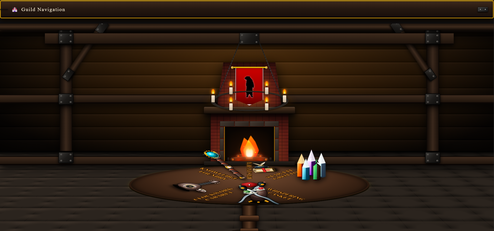

The inspiration for the Guild Hall was rooted in both D&D gameplay and medieval architecture. The structure was developed with the thought of grand mead halls, incorporating iron plates, tie-and-kneel plates, and squared-off timbers to reflect a hall where legendary tales were forged. 

While playing D&D, the party always gathers around the DM to spin a tale of adventure, mystery, and sometimes betrayal. To capture that same immersion, the DM's station is set at True North—designated by the fireplace directly behind them. The station weapons for each room were crafted to reflect both the character class and the distinct personality of each space.

### Pull up a chair, sit around the party’s table, and decide who you will play as:

  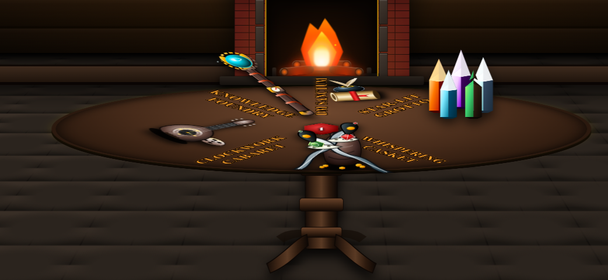

#### The DM

Will you take the seat of the DM and build epic tales filled with amazing monsters and cunning traps at the **DM's Sanctum**? At the DM’s seat, you will find your campaign scroll and an inkwell with a quill, ready for logging new lore.

  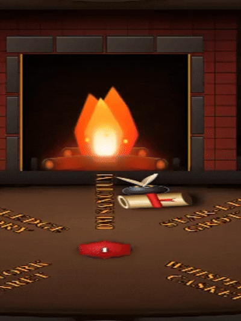

#### The Sorcerer

Will you step up as the Sorcerer and master the secrets of the elements and cosmos at the **Star-Lit Grotto**? Resting at your seat are five elemental shards:
* **Fire Shard (Back Left):** Glows with the might of the fiercest volcano when held.
* **Lightning Shard (Back Center):** Crackles and surges with thunderous electrical energy.
* **Air Shard (Back Right):** Traps the freezing breath of the West Wind, showing icy fractures fighting to break free.
* **Water Shard (Front Left):** Holds the clearest grotto waters, surging like the ocean's deepest tides.
* **Earth Shard (Front Right):** Harnesses violent seismic energy, causing the shard itself to fracture.

  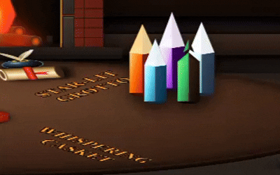

#### The Rogue

Will you play as the devious Rogue and try your hand at a game of chance at the **Whispering Casket**? The ill-gotten loot from swindling unsuspecting marks rests in your worn leather pouch, while your custom twin Kris daggers wait at your side to unleash chaos. 
* **The Left Kris:** Features your signature skeletal hand grasping a crimson d8 ruby.
* **The Right Kris:** Displays your signature skeletal hand holding a deep green d12 emerald.
* Both obsidian hilts are embedded with a golden trick coin ready for a slick flip.

  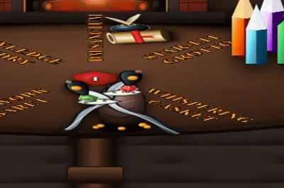

#### The Bard

Will you step up as the charismatic Bard and play a hypnotic tune on your Lute at the **Clockwork Cabaret**? Inspired by classic instruments and modified with mechanical precision, this lute features an etched clockface soundhole and internal cogwork. Grab the antique grandfather clock key and enter a world of rhythm that will keep the hall dancing for hours.

  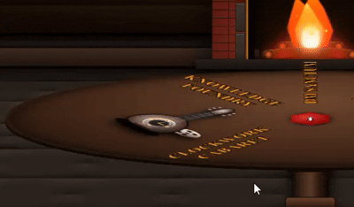

#### The Archmage

Will you play as the ancient and wise Archmage and test your intelligence at the **Knowledge Foundry**? Your steampunk wizard staff is ready to harness raw arcana and scientific experimentation. Feel the power surging through the blue arc-reactor core gem—but keep a close eye on the pressure gauge so you don't exceed your skill limit!

  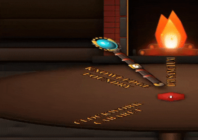

---

# 🎭 THE CLOCKWORK CABARET

Welcome to electrifying **Clockwork Cabaret**! Let me show you around-maybe play you a sound. You look like you're pretty groovy. The Clockwork Cabaret was stylized as if fantasy steampunk created a harmonizing dance with rock-n-roll. The stylized background was built to look like you were inside a true clockwork mechanism. The Bard’s signature lute stands prominent in the hall with his DJ Booth and Clockface Dance floor welcoming you into a night of glitz, glam, and a touch of decadence. 

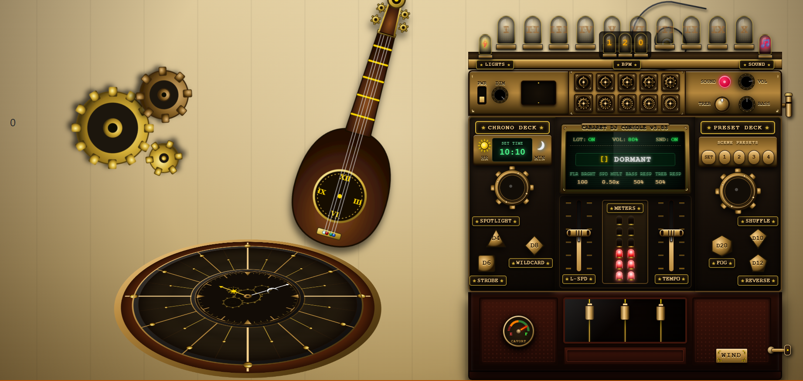

Step up to the enchanting **Clockwork Floor** and dance the hours away.

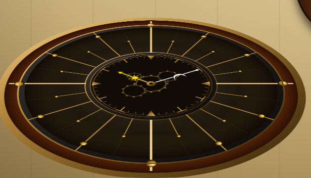

Stare off at the Lute Pendulum as it sways away the while the Clockwork Orchestra plays to the rhythm.

  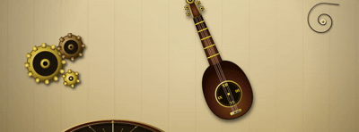

---

## ⚙️ The Dance Mechanism

The **Dance Mechanism** governs the dynamic floor tile lighting, hand choreography, and visual overlays across the 24 floor wedges ($15^\circ$ per step) on the `ClockworkFloor`. Each mode represents a unique visual theme, color palette, and algorithmic routine driven by a 24-step beat sequence.

### 📜 Mode Reference Guide

#### Mode OFF: "DORMANT" (Code: OFF / Base Mode)
* **Clockwork Floor Color**: Dark Charcoal (`#0a0a0a`)
* **Mechanism**: Static ambient idle animation.
* **Hand Choreography**: Free / standard timekeeping hands.
* **Floor Behavior**: Minimal ambient floor glow across inner/outer rings to indicate standby power.

---

#### Mode I: "CHECKERBOARD GRID" (Code: C)
* **Theme**: Precision Mechanical Clockwork
* **Central Hub Color**: Brass Gold (`#d4af37`) / Warm Copper (`#b87333`)
* **Clockwork Floor Color**: Black (`#0a0a0a`) / Red (`#d32f2f`)
* **Mechanism**: Static 24-grid wedge showcasing the beginning of a coding journey.
*	**Hand Choreography**: Hands snap to 2:40 / standard timekeeping.
*	**Floor Behavior**: Ambient floor glow illuminates as the Central Hub Face comes to life to indicate a dance routine has been engaged.

  

---

#### Mode II: "CHAOS GLITCH" (Code: PI)
*	**Theme**: Randomness & Mechanical Madness
*	**Central Hub Color**: Hot Pink (`#ff0080`)/ Rose Pink (`#ffb8d8`)
*	**Clockwork Floor Color**: Dynamically generated via the `ClockworkFloor` random color generator.
*	**Mechanism**: A wild explosion of colors constantly flashing and regenerating for an energetic dance routine.
*	**Hand Choreography**: Hands move in a chaotic jittery motion trying to keep up with the floor.
*	**Floor Behavior**: Chaotic flash of colors across all 24 floor wedges.

  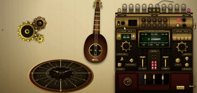

---

#### Mode III: "LUNAR ECLIPSE" (Code: PU)
*	**Theme**: Eerie Autumn Night
*	**Central Hub Color**: Purple (`#6900d1`)/ Lilac (`#c48aff`)
*	**Clockwork Floor Color**: Broken down into four wind components: Eye (`#c48aff`), Gust (`#9933ff`), Mist (`#3c1361`), and Void (`#0d0317`).
*	**Mechanism**: A cool breeze winds around the floor while covering the background in a lunar glow; the Crescent Moon (minute) hand shines brightly every four beats.
*	**Hand Choreography**: Hands snap to 6:00 / standard timekeeping.
*	**Floor Behavior**: Smooth, wispy wind effects glide across the wedges with transition timings that give Lunar Eclipse a distinct atmospheric, windswept twilight vibe.

  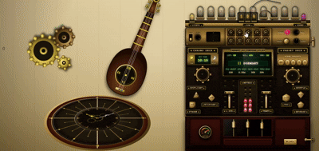

---

#### Mode IV: "COUNTER RETRACE" (Code: G)
*	**Theme**: Inverted radar sweeps guiding time backwards.
*	**Central Hub Color**: Emerald Green (`#00a341`) / Light Green (`#5cff9d`)
*	**Clockwork Floor Color**: Neon Green (`#00ff66`) beam. Even passes switch between Dark Emerald (`#005c25`) and Dark Green (`#001a0a`); odd passes flip between Sage Green (`#33ff88`) and Dark Green.
*	**Mechanism**: A bright green beam projects from the Crescent Moon (minute) hand to the floor as it sweeps counterclockwise with Directional Reversal support. Completing a rotation toggles floor tile contrast.
*	**Hand Choreography**: Hands snap to 12:58. Minute hand rotates counterclockwise; Sun hand rotates as minutes tick away.
*  **Floor Behavior**: Smooth sweep cleanly flips tile contrast on alternating passes. The sync between the clock face beam and the floor wedges adds a magical sway for partners.

  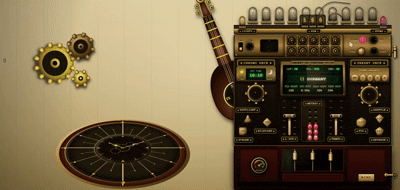

---

#### Mode V: "BEAM TRACKING" (Code: BU)
*	**Theme**: Space-Themed Radar Routine & Resonance Lifecycle
*	**Central Hub Color**: Celestial Blue (`#0062a3`)/ Cyan (`#5cbeff`)
*	**Clockwork Floor Color**: Scanning beam Celestial Blue (`#0099ff`) with trailing aura (`rgba(0, 153, 255, 0.35)`).
*	**Mechanism**: A celestial blue beam projected from the Sun (hour) hand scans clockwise over the cosmos with Directional Reversal. When sensing a constellation node (`cog`, `keyhole`, `gear`, `escapement`), it glows with a silhouette aura, illuminating in radiant gold upon direct intersection.
*	**Hand Choreography**: Minute Hand: Anchored firmly at 12 o'clock (Wedge 0). Sun Hand: Sweeps continuously across all 24 floor wedges ($15^\circ$ per step) with bidirectional rotation (`isReversed`).
*	**Floor Behavior**: Continuous Sun-hand sweep with exponential phosphor decay and a 3-stage proximity resonance lifecycle (Approach $\rightarrow$ Intersect $\rightarrow$ Recede) igniting clockwork constellation nodes.

  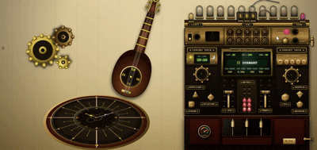

---

#### Mode VI: "SOLAR_FLARE" (Code: O)

*	**Theme**: RPG Spell Casting Narrative ("**I CAST FIREBALL!**")
*	**Central Hub Color**: Orange (`#d15400`)/ Pale Orange (`#ff9d5c`)
*	**Clockwork Floor Color**: Lava Orange (`#ff4500`) / Fiery Red (`#ff3300`) / Solar Gold (`#ffcc00`)
*	**Mechanism**: Single-pass 24-step cinematic spell lifecycle (auto-deactivates to `DORMANT` upon completion):
	1. **Charge & Countdown (Steps 0–15)**: Hour hand locked at 9 o'clock; minute hand targets 4 o'clock (20min). Solar ball swells on the 9 o'clock hub; lava countdown arc extinguishes step-by-step along bottom wedges (16 down to 10); "I CAST FIREBALL!!" runic text burns in letter-by-letter along top arc (wedges 20 through 4).
	2. **Catapult Launch (Steps 16–19)**: Sun hand recoils backward to 8 o'clock then snaps back to 9 o'clock. Fireball detaches and arcs across the top ring.
	3. **Impact & Detonation (Steps 20–22)**: Fireball impacts the 4 o'clock target (minute hand), triggering a supernova blast across wedges 5–8.
  4. **Cooling Ember & Hand Drop (Step 23)**: Minute hand drops limply to 6 o'clock (30min) from blast impact. Floor cools to ember ash (`rgba(80, 20, 0, 0.4)`), auto-resetting cleanly to `DORMANT`.
*	**Hand Choreography**: Reacts dynamically to the spellcaster's invocation.
*	**Floor Behavior**: The floor illuminates as the spell takes shape, erupting into a shockwave upon impact and leaving scorched ember marks in its wake.

  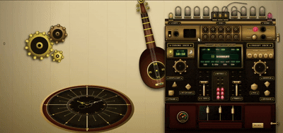

---

#### Mode VII: "DAYS FLY BY" (Code: CY)
*	**Theme**: 24-Hour Diurnal Sky Pass & Celestial Orbit
*	**Central Hub Color**: Dark Cyan (`#00a3a3`)/ Cyan (`#5cffff`)
*	**Clockwork Floor Color**: Incandescent Cyan (`#00ffff`) / Sunset Orange (`#ff5500`) / Dawn Pink (`#ff6699`) / Lunar Indigo (`#4b0082`)
*	**Mechanism**: Continuous diurnal sky cycle with rewind capability (`D12` / Reverse):
	1. **Sunrise / Dawn (Wedges 18–21)**: Soft pinks (`#ff6699`) and warm purple horizons emerging at 9 o'clock.
  2. **Midday Cyan (Wedges 22–3)**: High-noon white core with brilliant cyan (`#00ffff`) sky at 12 o'clock.
	3. **Dusk / Sunset (Wedges 4–9)**: Low warm oranges (`#ff5500`) and twilight blue-violet expanding at 3 o'clock.
  4. **Midnight Starlight (Wedges 10–17)**: Deep lunar indigo (`#4b0082`) with star tiles sparkling on beat steps.
*	**Hand Choreography**: Hands fixed as horizon guides at 9:15 (Hour Hand at 9 o'clock sunrise horizon, Minute Hand at 3 o'clock dusk horizon).
*	**Floor Behavior**: A glowing Sun marker orbits the rim during daytime, transforming into a Silver Crescent Moon during night hours. Toggling `D12 (Reverse)` literally rewinds the sun and sky pass backward across the dial.

  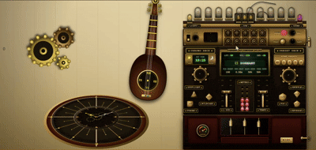

---

#### Mode VIII: "LEGACY TRANSITION" (Code: Y)
*	**Theme**: Origins & Progressions (Evolution of Light & Rhythm)
*	**Central Hub Color**: Yellow (`#ffd700`)/ Sepia Amber (`#b5873d`)
*	**Clockwork Floor Color**: Incandescent Bulb Yellow (`#ffe135`) / Electric Gold (`#ffd700`) / Antique Brass (`#d4af37`) / LED Cyan (`#00ffff`)
*	**Mechanism**: 4-Phase historical progression tracing human mastery over light and sound:
	1. **Phase 1: Primitive Sparks (Steps 0–5)**: Hands fixed at initial 2:40. Jittery spark bursts ignite outward from the hub toward 2, 5, 8, and 11 o'clock.
  2. **Phase 2: Lantern Waltz (Steps 6–11)**: 3/4 waltz rhythm in warm oil-lamp amber (`#ffbf00`). Minute hand glides smoothly while the hour hand snaps into place on the 3rd beat (pivoting between 3:15 and 8:40).
  3. **Phase 3: Dual Spiral Rock Groove (Steps 12–17)**: 1950s rock backbeat. Counter-rotating spirals in Antique Brass (`#d4af37`) and Electric Gold (`#ffd700`) cross paths while the hour hand steps forward ($8 \rightarrow 10$ o'clock) and the minute hand sweeps backward ($8 \rightarrow 6$ o'clock).
  4. **Phase 4: Electric Avenue Anthem (Steps 18–23)**: Full arena-rock pulse with a $360^\circ$ gradient (Amber bottom $\rightarrow$ Yellow mid-ring $\rightarrow$ High-voltage Cyan top). Hands drop to 6 o'clock, split outward to 9 & 3 o'clock along the strings, sweep up the neck, and clap together at 12:00, firing a 12 o'clock electric lightning burst on Beat 23.
*	**Hand Choreography**: Hands dance and sway to the rhythm of the light interacting with the floor.
*	**Floor Behavior**: Sway along as the history of light and sound dances through the floor bouncing between integral epochs of human history.

  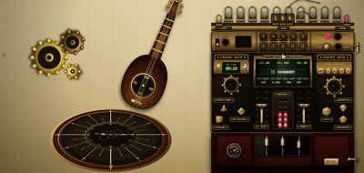

---

#### Mode IX: "MIDNIGHT THEATRE" (Code: R)
*	**Theme**: Midnight Theatre Campy Horror
*	**Central Hub Color**: Starts with Soft Brass Ambient / `isThrustingPhase` pops with electric crimson and white energy
*	**Clockwork Floor Color**: Step Energy Red (Low: `#ff0055`, Med: `#ff3366`, Med-High: `#ff0044`, High: `#e60039`) / Dim Floor Red (`rgba(50, 0, 15, 0.25)` to `rgba(100, 0, 30, 0.35)`).
* **Mechanism**: 7-Phase dance instruction on how to perform the classic campy horror dance icon—The Time Warp: 
	1. **Phase 1: "It's astounding..." (Beats 0–2)**: Start with hands in the air at 1:55 (170 BPM). 2. 
	2. **Phase 2: "A jump to the left!" (Beats 3–5)**: After the first dull red pulse, JUMP to the left with clock hands pointing at 11:45, illuminating target wedges. 3. 
	3. **Phase 3: "And then a step to the right!" (Beats 6–8)**: STEP hands to the right (12:50), lighting up new wedges. 4. 
	4. **Phase 4: "Put your hands on your hips..." (Beats 9–11)**: PUT hands on hips (8:40), illuminating side wedges. 5. 
	5. **Phase 5: "And bring your knees in tight!" (Beats 12–14)**: BRING knees in tight (5:35), illuminating the bottom floor section. 6. 
	6.**Phase 6: "But it's the pelvic thrust..." (Beats 15–22)**: THRUST hands outward in opposite directions; Hour hand spins wild clockwise while Minute hand spins wild counterclockwise. Central Hub Face flashes in a fast red/white strobe beat. 
	7. **Phase 7: System Depleted (Beat 23)**: The massive energy surge drains system reserves into an `isDepleted` power-down state.
*	**Hand Choreography**: Hands are choreographed to dance along with the lyrics, failing wildly into a wild spin as the routine concludes.
*	**Floor Behavior**: An electrifying, easy-to-follow dance instruction sequence to "Do the Time Warp Again!"

  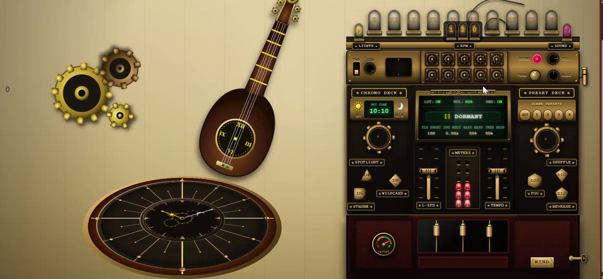

---

#### Mode IX: "LINE DANCE SPARKLE" (Code: RS)
*	**Theme**: Friday Night Country Line Dance Under the Stars 
*	**Central Hub Color**: Rose (`#ffb6c1`) / Sapphire (`#0099ff`) / Champagne Gold (`#ffbc05`)
*	**Clockwork Floor Color**: Rhythmic line dance flow between Rhinestone Diamond White (`#ffffff`), Champagne Gold (`#ffe135`), and Deep Sapphire (`#0099ff`).
*	**Mechanism**: 4-Phase "Boot-Scootin'" Line Dance with Backwall Rhinestone Fireworks:
	1. **Phase 1: Heel/Toe Steps (Steps 0–5)**: Minute hand kicks back and forth between 8, 9, and 10 o'clock while the Hour hand steps from $9:00 \rightarrow 10:00$.
  2. **Phase 2: Jazz Box & Quarter Turn (Steps 6–11)**: Minute hand sweeps dynamically as the Hour hand steps to 12:00.
  3. **Phase 3: Grapevine (Steps 12–17)**: Minute hand glides across the dial while the Hour hand reaches 3:00.
  4. **Phase 4: Finale Stomp (Steps 18–23)**: Both hands snap together at 5:00 ("Quitting time!"), triggering backwall rhinestone fireworks and internal hub cog energy glows on clap beats!
*	**Hand Choreography**: Hands step and kick in sync with line dance footwork, clapping on section beats.
*	**Floor Behavior**: A country night under a twinkling star field, complete with glowing rose dancer icons, backwall fireworks, and a 24-step line dance count.

  

---

## 🎛️️ The DJ Booth Controls

Don’t worry—the DJ has plenty more tricks up his sleeve throughout the DJ Booth!

### 🎚️ Master Command Bar

The Command Bar controls all lighting within the Cabaret as well as overall ambient brightness. The DJ also manages master sound power, volume, treble, and bass. Housed here as well is the Dance Mechanism state display and Cuckoo-Bird Housing.

  

### ⏱️ Chrono Deck

Set the time manually using the Sun Dial for hours and Moon Dial for minutes on both the `CentralHubFace` and the digital display. 

  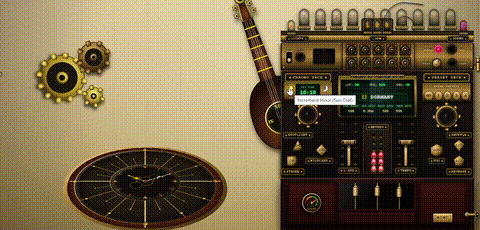

* **Spotlight (D4)**: Asks the DJ to dim ambient lights and drop a central spotlight for slow dances.
* **Strobe (D6)**: Engages high-frequency disco strobe lighting.
* **Wildcard (D8)**: Triggers high-voltage electric arc surges and spotlight beams.

  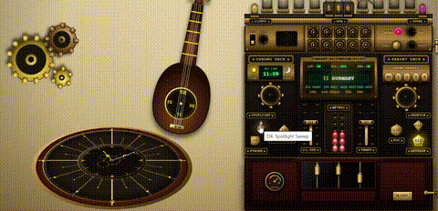

### ⚡ Central Control Panel & DJ Console v3.03
At the heart of the DJ Booth lies the **Cabaret DJ Console v3.03**, serving as the central nervous system connecting the analog steam mechanics to the digital visual arrays.
* **Cabaret DJ Console v3.03 Readout**: An illuminated central terminal displaying real-time system status, active mode name/code, current BPM, and live power drain metrics.
* **Turbo Ramp Slider**: A heavy brass linear fader that overclocks the internal engine. Pushing the Turbo Ramp past nominal thresholds accelerates beat timing, ramps up floor light intensity, and drives the gear train into high gear.
* **Light Speed (L-SPD) Ramp Slider**: Controls the global frequency multiplier for stage lighting, spotlights (D4), and strobes (D6). Ramping up L-SPD tightens beat pulses from slow-motion atmospheric glows into rapid-fire concert strobes.

  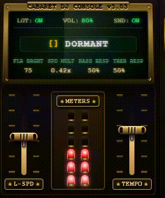

### 🎛️ Preset Deck
Save modified settings on the fly by activating the Preset System and selecting a preset slot for instant recall.

  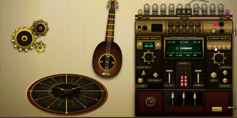

* **Shuffle (D10)**: Lets the booth pick a random dance routine for you.
* **Reverse (D12)**: Reverses the direction of active routines and gear mechanics.
* **Fog (D20)**: Fills the stage void with atmospheric steam and fog overlays.

  

### 🕰️ Grandfather Clock Stand & Power
The DJ Booth runs on steam power. The DJ must monitor the Cavort Gauge to keep energy flowing. As energy burns (determined by each mode's `burnRate`), the grandfather clock weights drop. If steam becomes completely `isDepleted`, the Cuckoo-Bird emerges from its housing to alert the DJ. Wind up the booth to restore power and keep the cabaret alive!

  

---

# The Guild Hall: Knowledge Foundry
The Guild Hall's Bestiary & Creature Repository, belongs to the Archmage and was inspired by my love of steampunk aesthetics, classic fantasy, and wild mechanical gadgets.

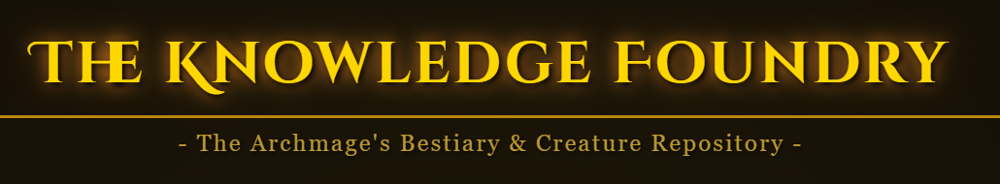

---

### Loading State
While the data is being fetched the Bestiary Loading screen flashes as seed data populates from the `FullMonster` GET request:

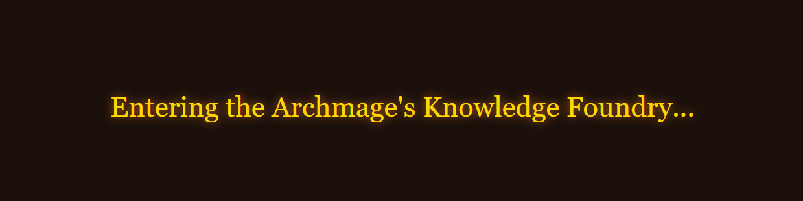

---

### Main Creature Card
Upon entering the Bestiary, the main creature card adopts a layout inspired by conventional D&D creature stat blocks:
 * **Header:** Displays the creature's name, size, type, and alignment. 
 * **Middle Section** Split between core stats, vitals, and rewards on the left with the creature's portrait on the right. 
 * **Bottom Section** Split between the primary attacks and special attributes. 

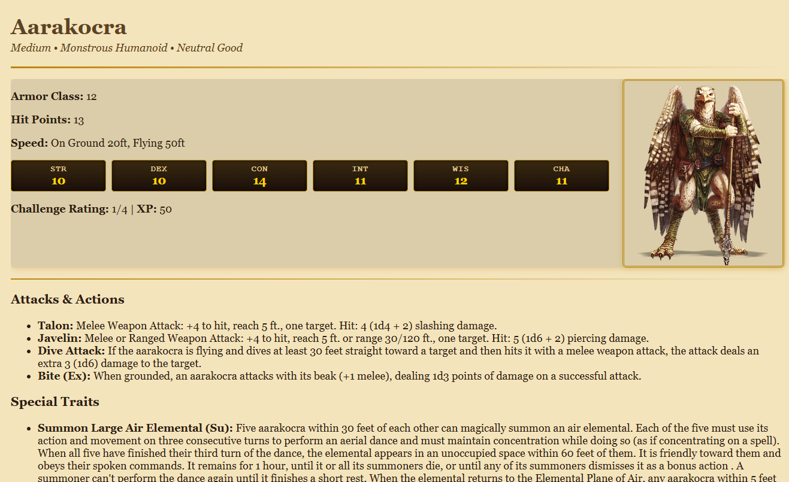

---

### Right-Side Control Panel Experience

Designed specifically to help onboard new Dungeon Masters (DM) who may be unfamiliar with D&D mechanics.

#### Creature Information (Bottom Half)
Helps new DMs quickly understand what a creature's type implies, what their alignment ethos signifies, along with a detailed creature analysis and lore breakdown.

  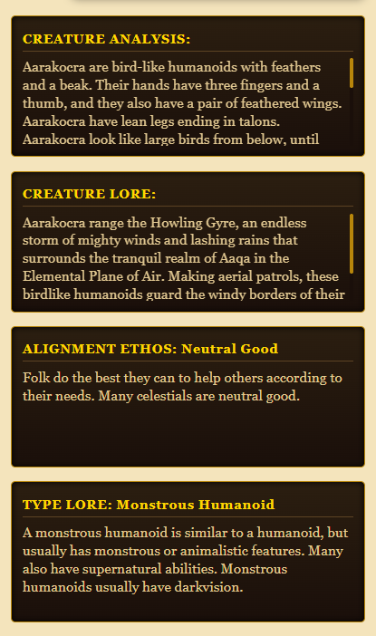

#### Dynamic Actions & Filtering (Top Half)

* **Live Search:**
A dynamic search bar at the top instantly filters out creatures from the main cog mechanism as you type.

    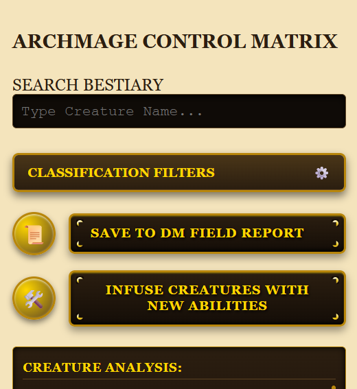

* **Felt Drop-Down Drawer:**
Allow the DMs to search by monster type. For example, if a DM wants to build an undead army. Select the cog on the drawer and in the drop-down drawer select the lightbulb next to "Undead". The main lower cog will filter out all non-undead creatures. 

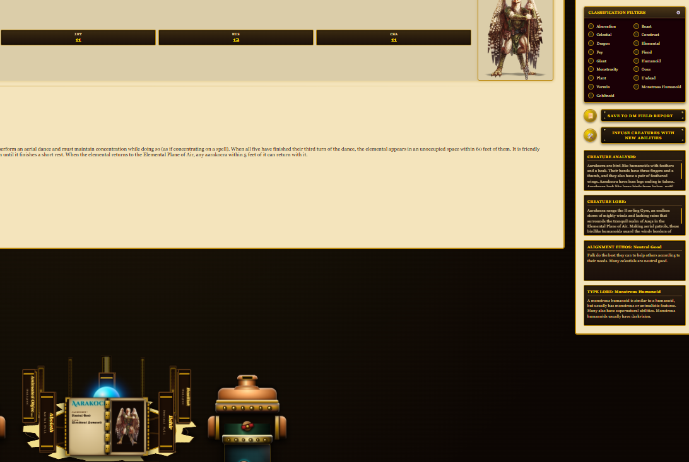

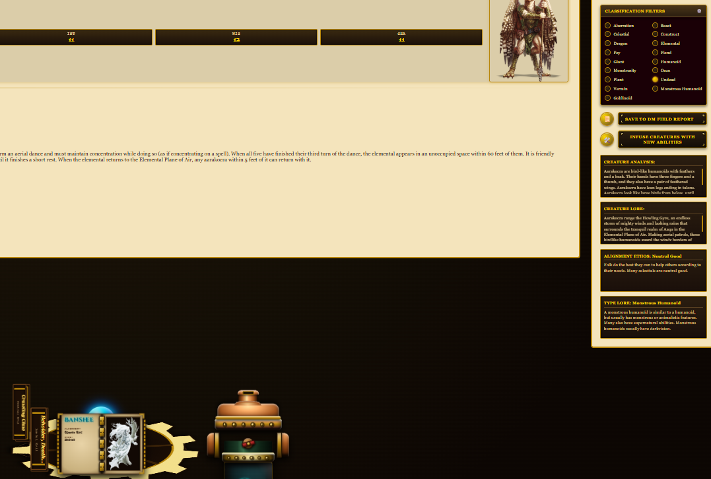

#### Immersive Action Buttons

* **Save to DM Field Report:**
Allowing the DM to save a creature's base stats directly to their campaign report for retrieval elsewhere in the Guild Hall.

* **Infuse Creatures with New Abilities:**
Empowers the DM to dynamically modify and upgrade a creature's base stats for custom encounters.

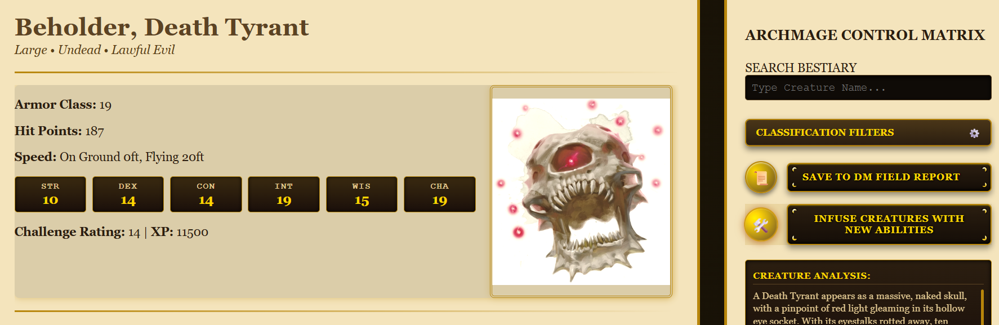

---

### Creature Forge & Field Workshop

  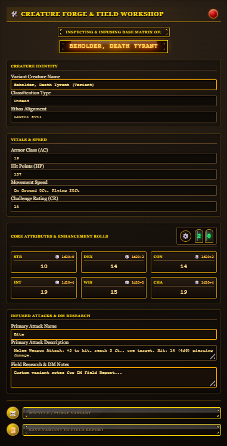

The Creature Forge is where the DM can create a one of kind variant. As the DM modifies a field the border will highlight the edges gold.

#### Creature Forge (Top Half)

* **Header:**
The top half of the Forge has a mystical ruby gem infused into a brass ring allowing the DM to close out of the forge. Below that the DM will see the active monster's name flickering just underneath a riveted plaque.

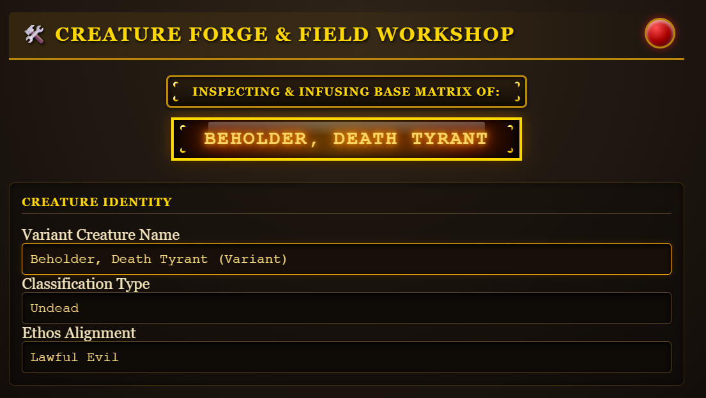

* **Creature Identity:**
Allows the DM to change the creature's name, its type classification, and it's alignment ethos.

#### Creature Forge (Second Section)
* **Vitals and Speed:**
In this section the DM can update the creature's Armor Class, Hit Points, Experience Points, Speed, and Challenge Rating.

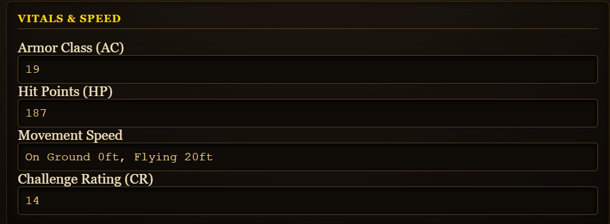

#### Creature Forge Stats

* **Core Attributes & Enhancements Rolls:**
As the DM builds their variant they can improve on their core attributes using d20 rolls.

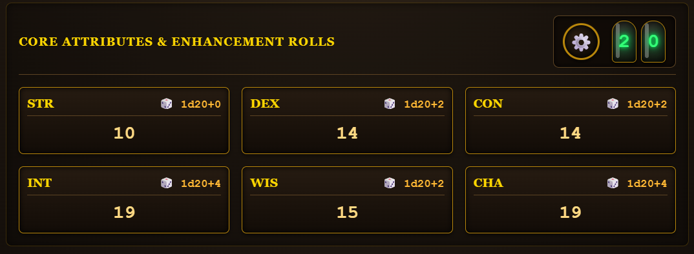

Don't have a physical d20? The Forge has you covered with a steampunk-inspired, pneumatic nixie-tube green light dice counter. Just press the gear and let the tube roll the dice!

  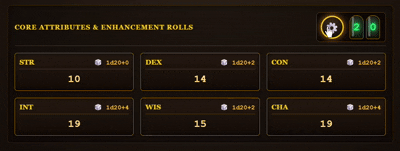

#### Creature Forge Bottom Section

* **Infused Attacks & DM Research:**
If the DM would like to give his variant a special ability or make important tactical notes, they can record them here.

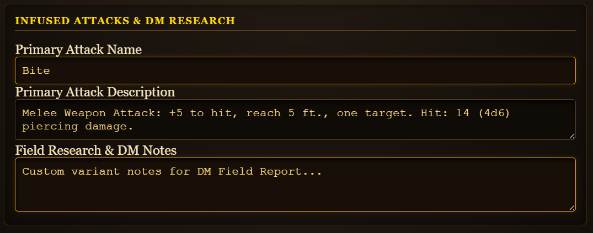

#### Forge Action Buttons

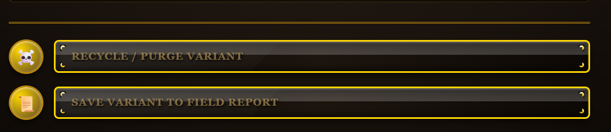

* **Recycle / Purge Variant:**
If the DM determines the variant isn't worth saving, they can purge the variant from the system.
* **Save Variant To Field Report:**
Saves the creature variant directly to their campaign report for retrieval elsewhere in the Guild Hall.

  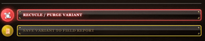

---

### The Archmage’s Knowledge Foundry

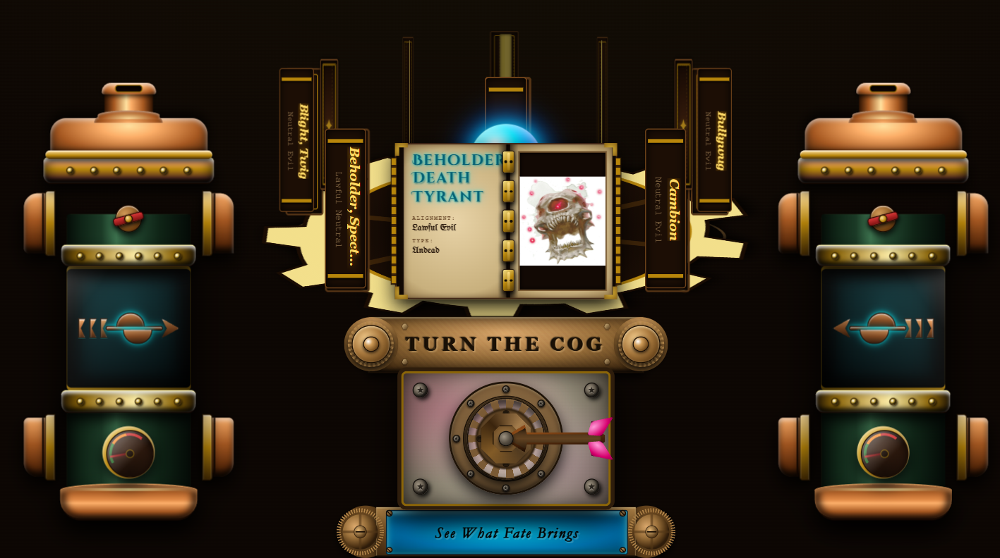

* **The Foundry's Ancient Cog:**
The Archmage’s Knowledge Foundry is where all ancient lore and creature knowledge is stored. The Archmage placed a protection spell on his tomes balancing an ancient spinning cog upon a magical orb. Selecting the active (center) tome updates the active monster in the Main Creature Card.

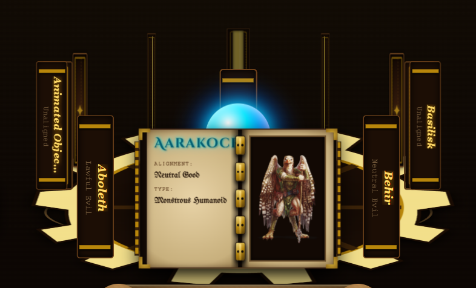

* **The Foundry's Engine Stacks:**
The Archmage imbued the canisters to handle transitions between the various tomes on the cog, venting excess magic energy. When normal magic energy is released, it appears as a simple blue mist while the gauge needle rises in acknowledgement.

  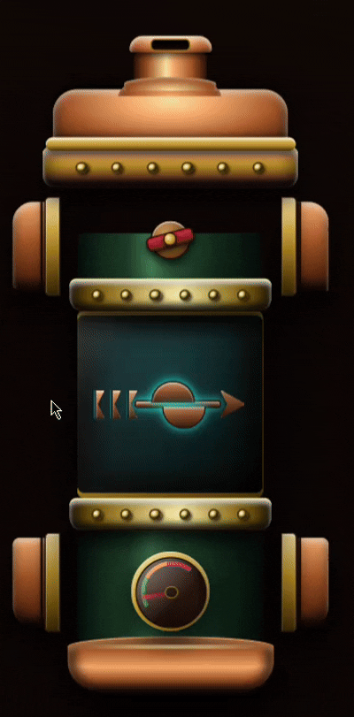

Each canister controls the cog and its tome rotation in one of two directions. The cog to the left handles the tradtional previous button.

  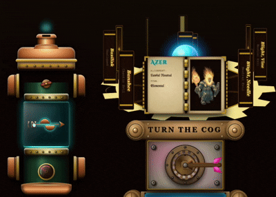

The cog to the right handles the tradtional next button.

  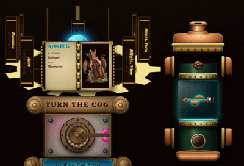

* **The Foundry's Wild Magic Container:**
The Archmage borrowed Fate's ability to predict what the DM is looking for by infusing the marbled plate underneath the cog with special magic. 

  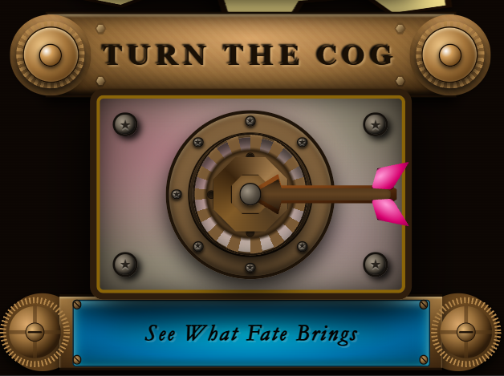

The magic randomly spins the cog to select a creature. However, the wild magic is so unpredictable that it over pressurizes all the key components maintaining the cog. The engine canister's vent stack must work overtime to vent the excess magic quickly!

  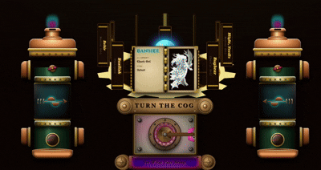

* **IMAGES USED:**
The Images and creature are from the Wizards of Coast DnD Beyond